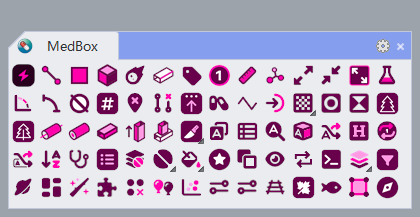

# 命令详解 🎉

<!-- emoji: https://www.webfx.com/tools/emoji-cheat-sheet/ -->



**MedBox 目前已有80+公开命令** 

::: details <HopeIcon icon="fa-solid fa-wave-pulse" /> Analysis（分析类）
- B_Length
- B_Area
- B_Volume
- B_Weight
- B_PipeLength
- B_PlanarHeightTest
:::

::: details <HopeIcon icon="fa-solid fa-circle-small" /> Point（点类）
- B_ImportPoints
- B_PointOnCurve
- B_PushPointOnCurve
- B_ExportLocation
:::

::: details <HopeIcon icon="fa-solid fa-wave-sine" /> Curve（曲线类）
- B_FitArc
- B_ToPolyline
- B_Make2D
:::

::: details <HopeIcon icon="fa-solid fa-square" /> Surface（曲面类）
- B_ExtendEdge
:::

::: details <HopeIcon icon="fa-regular fa-square-quarters" /> Plane（平面类）
- B_AddPlane
- B_PlaneIntersect
- B_InsertConstructionPlane
- B_PlaneSplit
- B_PlaneTrim
:::

::: details <HopeIcon icon="fa-solid fa-grip-lines" /> Linear（型材类）
- B_GenTube
- B_GenTubeByIntersect
- B_GenTubeByProject
- B_GetPipeRail
- B_HatchOutline
- B_PipeHelper
:::

::: details <HopeIcon icon="fa-solid fa-arrows-left-right-to-line" />  Dimension（标注类）
- B_AddAngularDimensionByNode
- B_AddAxisNumber
- B_AddDot
- B_AddDotByDistance
- B_AddDotByLength
- B_AddDotByLocation
- B_AddLinearDimensionBy3Pt
- B_AddLinearDimensionByArc
- B_AddLinearDimensionByDiagonal
- B_AddLinearDimensionByInterior
- B_AddLinearDimensionByNaked
- B_AddRadialDimension
- B_Stamp
:::

::: details <HopeIcon icon="fa-solid fa-a" /> Text（文本类）
- B_Text
- B_AnnotationAndTextDotConver
- B_FindText
- B_FindTextFromInsertion
:::

::: details <HopeIcon icon="fa-solid fa-shapes" /> Object（物件类）
- B_ObjectAttributes
- B_ObjectChangeColor
- B_ObjectDrop
- B_ObjectFilter
- B_ObjectNameReplace
- B_ObjectShare
- B_ObjectTable
- B_SetSequence
:::

::: details <HopeIcon icon="fa-solid fa-layer-group" /> Layer（图层类）
- B_CopyLayerToClipboard
- B_ImportLayerFromClipboard
- B_LayerChangeColor
- B_LayerFullPath
- B_LayerNameReplace
- B_LayerOnlyShow
- B_FindLayerFromObject
:::

::: details <HopeIcon icon="fa-solid fa-draw-square" /> Group（群组类）
- B_GroupByBound
- B_GroupBySimilarSrf
:::

::: details <HopeIcon icon="fa-solid fa-check" /> Selection（选取类）
- B_SelBlock
- B_SelEdge
- B_SelLength
- B_SelMatchText
- B_SelObject
- B_SelSimilar
:::

::: details <HopeIcon icon="fa-solid fa-list" /> Multiple（多项类）
- B_SiftSrf
- B_CullDuplicate
- B_CullDuplicateCrv
- B_CullDuplicateSrf
:::

::: details <HopeIcon icon="fa-solid fa-draw-square" /> Transform（变换类）
- B_Rotate
- B_Scale
- B_Project
- B_UniformDirection
- B_CornerPin
- B_Slide
- B_Planarization
- B_CurveSnap
:::

::: details <HopeIcon icon="fa-solid fa-hammer" /> Utility（实用类）
- B_ChangeColorTheme
- B_Start
- B_SetMacro
- B_ResetRtf
:::


<!--

::: tip 提示
这是一个提示
:::

::: warning 警告
这是一个警告
:::

::: danger 危险
这是一个危险警告
:::

::: details 点击展开详情
这是一个详情块，在 IE / Edge 中不生效
:::

:::: code-group
::: code-group-item FOO
```js
const foo = 'foo'
```
:::
::: code-group-item BAR
```js
const bar = 'bar'
```
:::
::::

-->